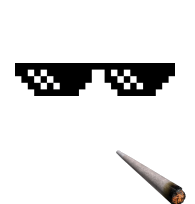

# SnapChat-Filter
This project is for fun. It is same as snapchat and instagram filter. In this program is detect the face in live video and place a thug life(Cigratte and spaces) image on the users face and move along with the users face. In this project we are using OpenCV face detetction algorithm for finding the face in the image and for placing image we are using PIL library. 

